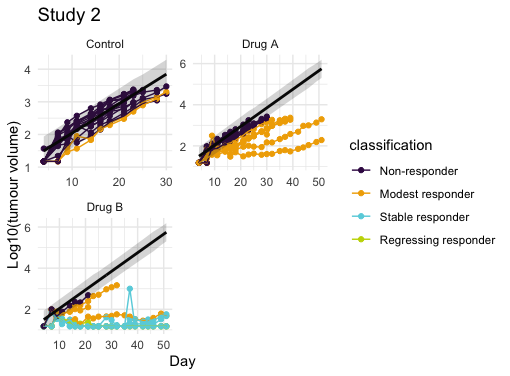
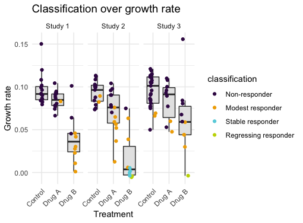
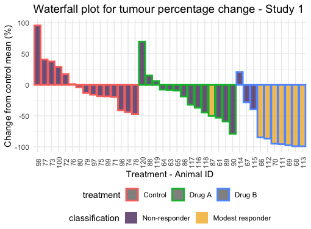

# IN-vivo reSPonsE Classification of Tumours (INSPECTumours)
This is a statistical tool used for classifying and analysing pre-clinical tumour responses. 

# 1 Overview 

# 2 User guide

## 2.1 Load data 

### 2.1.1 Data requirements
* .csv or .xlsx long format 
* multiple input files for the new experiments can be uploaded
* the historical control data should be uploaded through a separate button 

**New studies**

Critical columns:

* study_id (string)  
* treatment - there must be a group called "Control" (or "control") as the reference group
* animal_id 
* day (day after tumour implantation) 
* tumour_volume - $mm^3$

There should be a control group for each study_id.

**Historical control data (highly recommended – this will increase the robustness of the analysis)**  

Critical columns: 

* study_id 
* treatment – only contain the group called "Control" (or "control")
* animal_id 
* day (day after tumour implantation) 
* tumour_volume – $mm^3$

### 2.1.2 Data quality Control (QC)

**Automatic QC**

* Tumour volumes less than 15 $mm^3$ are replaced by 15 $mm^3$.
* Animals with measurements less than "Min number of data points for one animal" will be deleted. The recommendation is to use "Min number of data points for one animal" = 3 but you can change it. 
 
**Manually outlier removal**

Data visualisation and QC are available in "QC New study" and "QC Control data" subsections. 

Specific data points can be excluded from the analysis per study, when providing a reason:

* An entire day (e.g. welfare measures)
* Animal at a specific day
* An entire animal
 
## 2.2 Analysis 

### 2.2.1 Tumour classification

By using a novel statistical method, which is explained in section "3. Statistical methods", each individual tumours are classified into one of the following categories: Non-responder, Modest responder, Stable responder and Regressing responder. Briefly, a statistical model is constructed for the control data, including the historical control data, to predict the normal growth profile. If a tumour falls within the prediction interval of the normal growth profile, the tumour is classified as "Non-responder", otherwise, it is classified as a responder. All responders are further classified into sub-categories based on the growth rate calculations.

**Analysis setting**

* End day of modelling - This will define the period of time used for the statistical modelling of the control data. The selection of this time period should ensure that there are sufficient days to model growth behaviour and the drug is expected to be effective during this period. For example, we recommend the last dose day for immunotherapy studies. To help inform the selection, the visualisation of data in the “Control data QC” section will explore the data loss with time. Due to animal welfare, animals are terminated before the end of the study if the tumour volume is large. The animal loss will affect the estimate of the tumour growth. In particular, the two-stage non-linear model as explained below may capture the inflection time point when there is a large number of animal loss rather than the stable tumour growth phase. We have used “End day of modelling” to define the period of time when the control data are used for the model. There are two factors to consider when select the “End day of modelling”. First, the animal loss across all studies and the figure of survival rates can be used to visualise the survival rates. You can find the survival plot in "QC Control Data" subsection. The following plot is an example of the percentage of survived animals across studies. We can see that after day 25, more than 50% animals were lost in all 5 studies. Second, the statistical model outcome will be used to assess the tumour growth of treated animals later. The period of modelling shouldn’t be too short to capture the period of drug effects. Therefore, we recommend to define this period when the drug is effective, for example, the last dose day for immunotherapy studies.   

* Cut-off day for responder classification (optional) - This will define the period of time used for the growth rate calculation. If you observe the tumour regrowth, please give the cut-off day to derive a more reliable growth rate. If there is no input for “Cut-off day for responder classification”, all available data will be used. 

* Consecutive measurements for classification - For individual tumour responders, we expect at least m consecutive data points fall below the prediction interval of the control tumour growth. Please provide the number of (average) measurements per week in you experiment, if there are more than 3 measurements per week

* Model type - This will define whether two-stage non-linear model or linear model will be used for the control data. The two-stage non-linear model (default) is able to capture different tumour growth rates at unstable and stable tumour growth phases. However, the computational time is longer. The plot for the two-stage non-linear model is shown as follows. You can see that the growth rate (slope) change at day 10, which is called as the inflection time point. 

**In order to run the analysis, please tick "QC check" box. When you click "Start", the analysis will start!**

**Results**

* Control growth profile - The plot shows the model fitting for the control data. The dark lines indicates the tumour growth predicted values and the grey area indicates 95% prediction intervals. 

* Classification table - This table shows the classification for individual tumours in the column of "classification", together with growth rate calculation and standard error in the columns "gr" and "gr_se".

* Classification over tumour volume - This plot shows tumour volumes for individual tumours, with different colours indicating different categories. If there is any tumour labelled as "Not reliable", it will be removed.   

* Classification over growth rate - This plot shows growth rates for individual tumours, with different colours indicating different categories. 

* Waterfall plot - This plot shows percentage changes of tumour volumes from the control mean, with different colours indicating different categories. 

### 2.2.2 Statistical analysis for drug efficacy(optional)

Additional statistical analysis to compare drug efficacy (treated vs. control) is available. The Bayesian ordered logistic regression is used for the analysis. 

* Animal summary - The summary table and barplot show the animal numbers and percentage for each tumour classification category in each group. 

* Drug efficacy - The output table shows the results from ordered logistic regression. The drug efficacy is assessed by using 95% credible interval and indicated by asterisks if the drug is considered significantly effective.  

# 3 Statistical methods 

## 3.1 Statistical model for the control data 

To analyse the tumour volume data, summarising the time series as the growth rate [1, 2] is commonly used. The subsequent assessment of drug efficacy is then based on statistical tests comparing the mean growth rates between different groups. However, this group-level analysis is insufficient when heterogenous tumour growth is observed within a treatment group. 

We have developed a novel method by building the statistical model for the “normal” tumour growth profile without treatment. 

### 3.1.1 Two-stage non-linear model 

A multilevel (or called “mixed-effect”) non-linear model is constructed for all control data, including both the control data from new studies and historical studies (if available). 

$$log_{10}(y_{ijk}) \sim f(t_{ijk}) + \alpha_i + \beta_{ij} + e_{ijk},$$

with $y_{ijk}$ indicate the tumour volume that is measured on the $k$th day for the $j$th animal in the $i$th study and $t_{ijk}$ indicates the day of measurement.  The random effect term $\alpha_i \sim N(0, \sigma_{study}^2)$ is used to evaluate the day-to-day variability; $\beta_{ij} \sim N(0, \sigma_{animal}^2)$ is used to evaluate the animal-to-animal variability and the error term is $e_{ijk} \sim N(0, \sigma^2).$

We use the continuous hinged function that was posted by Gelman A. (https://statmodeling.stat.columbia.edu/2017/05/19/continuous-hinge-function-bayesian-modeling/) to allow different growth rates between the early stage of tumour growth ("unstable" phase) and the later stage ("stable" stage). The function is shown as follows: 

$$f(t_{ijk}) = a + b_{0} \times (t_{ijk} - t_{change}) + (b_{1} - b_{0}) \times \delta \times log(1 + \frac{exp(t_{ijk} - t_{change})}{\delta}),$$

where where $a$, $b_0$ and $b_1$ are common intercept, the slope for the unstable phase and the slope for the stable phase respectively. A parameter $\delta$ is used to control the smoothness of the curve as shown in Figure 3 and the parameter $t_{change}$ is the inflection time points to separate the unstable and stable phases. Mathematically, the slope changes at $t_{change}$. The design of studies may vary in practice. For example, the windows between the tumour implantation and first dose of compounds can be between 1 day to 7 days in different experiments. We observed that $t_{change}$ for different studies can be different accordingly sometimes. Therefore, a flexible Baysian model is used for the study-varying $t_{change}$ estimation. 

### 3.1.2 Linear model 

Alternatively, the simplified linear model can be used for the data. This will consider a unified slope through the study. The model equation is shown as follows.

$$log_{10}(y_{ijk}) \sim a + b \times t_{ijk} + \alpha_i + \beta_{ik} + e_{ijk},$$

with $y_{ijk}$ indicate the tumour volume that is measured on the $k$th day for the $j$th animal in the $i$th study and $t_{ijk}$ indicates the day of measurement.  The random effect term $\alpha_i \sim N(0, \sigma^2_{study})$  is used to evaluate the study-to-study variability; $\beta_{ij} \sim N(0, \sigma^2_{animal})$ is used to evaluate the animal-to-animal variability and the error term is $e_{ijk} \sim N(0, \sigma^2)$.

## 3.2 Tumour classification 

The 95% predication interval is derived from the model for the control data. The tumours that are higher than the lower bound of 95% prediction interval are considered as not significantly different from the “normal” tumour growth. For an individual tumour, if there are m consecutive measurements that are smaller than the lower bound of 95% prediction interval, the tumour is considered as “Responder”. Otherwise, the tumour is classified as “Non-responder”. In order to ensure the classification is reliable for the tumour over a period that is long enough, the selection of m depends on the schedule of measurements. If there are 3 or less measurements per week, we consider m = 3. Otherwise, m is equal to the number of measurements per week. 

All responders are classified into sub-categories based on the tumour growth rates. It is common to assume tumours grow exponentially, and thus the linear model can be fitted for the log transformed tumour volumes over time:

$$log_{10}(y_k) = a + b \times t_k + e_k $$

where $y_k$ is the measured tumour volume on the day $t_k$, while $a$ is the intercept and $e_k \sim N(0, \sigma^2)$. The estimation of slope $b$ is defined as the tumour growth rate. 

To improve the accuracy of the estimation of the growth rates, we will only use data between $t_{change}$ that is derived from the two-stage non-linear model to the “Cut-off day for responder classification”. If there is no input for “Cut-off day for responder classification”, the day for the end of study will be used. 
Based on the sign of the growth rate, the “Responder” tumours are further classified by the sign of the growth rate and two-sided T test. If the growth rate is not significantly different from 0, the tumour is classified as “Stable responder”. We consider a tumour with growth rate significantly larger than 0 as a “Modest responder”, which shows a response to the treatment although the tumour still growth slowly. A strong drug effect is concluded if the tumour growth rate is significantly smaller than 0 and the tumour is classified as “Regressing responder”. 

## 3.3 Statistical analysis for drug efficacy 

In order to compare the tumour responders from different treatment groups, a Bayesian ordered logistic model is used for the output from either a single study or multiple studies. This analysis convert the tumour classification into ordinal data (0 - non-responder, 1 - modest responder, 2 - stable responder, 3 regressing responder). We can use a latent variable $y^*$ to describe the tumour classification: 

$$
Tumour.classification =  
\begin{cases}
\textit{0 (non-responder), if } y^* \leq \mu_1 \newline
\textit{1 (modest responder), if } \mu_1 < y^* \leq \mu_2 \newline
\textit{2 (stable responder), if } \mu_2 < y^* \leq \mu_3 \newline
\textit{3 (regressing responder) other}\newline
\end{cases}
$$

with $$y_{ijk}^* = b_j + \alpha_i + e_{ijk}, $$ where $b_j$ indicate the mean of tumour classification for the *j* th group; $\alpha_i \sim N(0, \sigma_{study}^2)$ is the study-to-study variability and $e_{ijk} \sim N(0, \sigma^2).$ From this model, we are able to compare the treatment group through the team $\mu_i$. 

## 3.4 References 

(1) Hather G. et al., (2014)  Growth Rate Analysis and Efficient Experimental Design for Tumor Xenograft Studies: Supplementary Issue: Array Platform Modeling and Analysis (A). Cancer Informatics, 13, 65-72

(2) Karp N. et al. (2020) A multi-batch design to deliver robust estimates of efficacy and reduce animal use – a syngeneic tumour case study. Scientific Reports, 10, 6178 

